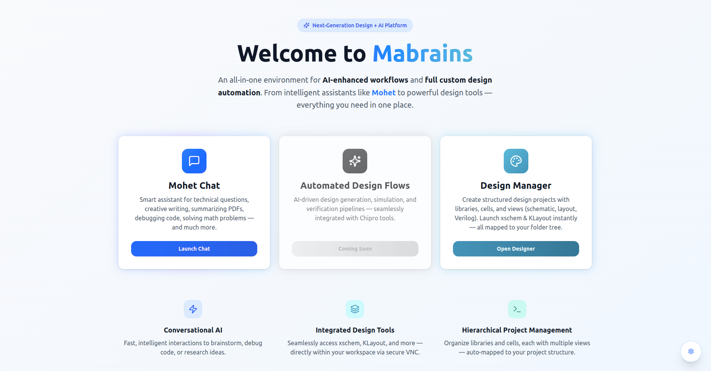

#  Chipro Overview

**Chipro** is an **Agentic EDA environment** that unifies design management, simulation, automation, and AI assistance within a single collaborative workspace.

It provides an **integrated, browser-based environment** where engineers can:
- Manage **projects, libraries, categories, and cells**  
- Interact with **Mohet Chat**, the embedded AI assistant  
- Launch tools like **xschem**, **KLayout**, and **ngspice** directly  
- Track design versions, PDKs, and simulations seamlessly

---

##  Core Components

Chipro is composed of three major modules, each tightly integrated:

| Module | Description |
|--------|--------------|
| **Design Manager** | Central workspace for managing libraries, categories, and cells. Handles versioning, commits, and PDK integration. |
| **Mohet Chat** | Context-aware conversational assistant embedded directly into the Chipro workspace. |
| **EDA Automation Layer** | Provides tool launchers (schematic/layout/simulation), containerized job execution, and version-tracking integrations. |

---

##  Unified Workspace Layout

The Chipro interface uses a **five-pane adaptive layout**:

1. **Projects Sidebar** — Lists all projects, grouped by PDK or foundry.  
2. **Libraries Sidebar** — Displays libraries for the selected project.  
3. **Categories Sidebar** — Organizes cells within a library.  
4. **Main Workspace** — Displays cells grid and design actions.  
5. **Cell Details Panel** — Shows metadata, available views, and tool launchers.

##  Agentic AI Integration

Through **Mohet Chat**, users can:
- Ask design-related questions directly from the workspace  
- Generate or explain SPICE/Verilog code  
- Analyze simulation results  
- Trigger automated design reviews  

Mohet’s context awareness allows it to reference your **active cell, PDK, or tool** without additional configuration.

---

##  Next Steps

- [Design Manager →](./design-manager/overview.md) — Explore how libraries, categories, and cells are structured  
- [Mohet Chat →](./mohet.md) — Learn how to interact with the AI assistant inside Chipro
